# LangChain on AWS Lambda (Python)

A small hobby example showing how to run a simple LangChain prompt using OpenAI from an AWS Lambda container image exposed via API Gateway.

## Architecture

```mermaid
graph TB
    User["👤 User Browser<br/>http://langchain-ui-garethlw<br/>.s3-website.ca-west-1<br/>.amazonaws.com"]
    
    S3["🪣 S3 Static Website<br/>index.html<br/>(public read)"]
    
    APIGW["🔌 API Gateway<br/>REST API<br/>CORS Enabled<br/>https://4el2g4v5gi<br/>.execute-api<br/>.ca-west-1<br/>.amazonaws.com"]
    
    Lambda["⚡ Lambda Function<br/>Python 3.11<br/>512 MB Memory<br/>30s Timeout<br/>Container Image"]
    
    ECR["🐳 ECR Registry<br/>langchain-lambda<br/>Python 3.11 Base<br/>LangChain + OpenAI"]
    
    Secrets["🔐 Secrets Manager<br/>my-openai-key<br/>(encrypted)"]
    
    OpenAI["🤖 OpenAI API<br/>GPT-3.5-turbo<br/>Chat Completions"]
    
    Logs["📊 CloudWatch Logs<br/>Lambda execution<br/>logs & errors"]
    
    GitHub["🐙 GitHub<br/>GarethLW/<br/>lambda-langchain<br/>master branch"]
    
    GHA["⚙️ GitHub Actions<br/>CI/CD Pipeline<br/>OIDC Auth"]
    
    User -->|"1. Load HTML<br/>2. Submit prompt"| S3
    S3 -->|"3. Fetch request<br/>(CORS)"| APIGW
    APIGW -->|"4. Invoke<br/>(proxy integration)"| Lambda
    Lambda -->|"5. Pull API key"| Secrets
    Lambda -->|"6. Call LLM"| OpenAI
    OpenAI -->|"7. Return completion"| Lambda
    Lambda -->|"8. Return response<br/>(JSON)"| APIGW
    APIGW -->|"9. Response<br/>with CORS headers"| User
    Lambda -->|"10. Stream logs"| Logs
    
    Lambda -.->|"Uses container from"| ECR
    ECR -.->|"Built & pushed by"| GHA
    GHA -.->|"Triggered by push to"| GitHub
    Lambda -.->|"Looks up secrets in"| Secrets
    
    style User fill:#e1f5ff
    style S3 fill:#fff3e0
    style APIGW fill:#f3e5f5
    style Lambda fill:#e8f5e9
    style ECR fill:#fce4ec
    style Secrets fill:#f1f8e9
    style OpenAI fill:#ede7f6
    style Logs fill:#fff9c4
    style GitHub fill:#e0f2f1
    style GHA fill:#ede7f6
```



**Flow**: User loads S3 website → submits prompt → API Gateway routes to Lambda → Lambda fetches OpenAI key from Secrets Manager → calls OpenAI via LangChain → returns response to browser with CORS headers. CI/CD pipeline (GitHub Actions) automatically builds container and deploys via SAM.

## Quick start

1. Create an OpenAI API key and set it locally:

   ```bash
   export OPENAI_API_KEY="sk-..."
   export OPENAI_MODEL="gpt-3.5-turbo"  # optional
   ```

2. Build the container image and push to ECR (SAM expects an image URI in `template.yaml`):

   ```bash
   docker build -t langchain-lambda:latest .
   # create ECR repo, tag and push (replace with your account/region)
   ```

3. Update `template.yaml` with your ECR image URI, then deploy with SAM / CloudFormation.

## Local testing

- Run unit tests:

  ```bash
  pip install -r requirements.txt
  pytest -q
  ```

- You can invoke `handler.lambda_handler` directly for quick checks.

## Cost & billing tips (hobby)

- Use `gpt-3.5-turbo` or small models to keep costs low. Limit `max_tokens` from the client.
- The handler enforces a `max_tokens` upper bound of 1024.
- For repeated prompts, the example includes an in-memory LRU cache to avoid repeated API calls during development.

## Environment variables

- `OPENAI_API_KEY` (required)
- `OPENAI_MODEL` (optional, defaults to `gpt-3.5-turbo`)

## Next steps

- Add Secret Manager or Parameter Store integration to store credentials securely. (Implemented)
- Add CI to build/publish the container image to ECR automatically. (Implemented example)

---

## Deploying with AWS SAM (basic flow)

1. Build and push an image to ECR:

   ```bash
   # Example: tag and push; use your account/region/repo
   docker build -t langchain-lambda:latest .
   # create repo and push (example steps omitted)
   ```

2. Set the `ImageUri` parameter and deploy with SAM:

   ```bash
   sam deploy --template-file template.yaml --stack-name langchain-lambda \
     --parameter-overrides ImageUri=123456789012.dkr.ecr.us-east-1.amazonaws.com/langchain:latest \
     --capabilities CAPABILITY_IAM
   ```

3. If you're using Secrets Manager, store a secret containing either the raw API key or a JSON object with `OPENAI_API_KEY`:

   ```bash
   aws secretsmanager create-secret --name my-openai-key --secret-string "sk-..."
   # or
   aws secretsmanager create-secret --name my-openai-json --secret-string '{"OPENAI_API_KEY":"sk-..."}'
   ```

   Then deploy with `OpenAISecretName` pointing to that secret name or ARN.

## Using the Secrets Manager integration

- The Lambda will first look for `OPENAI_API_KEY` in the environment for local dev convenience.
- If unset, and if `OPENAI_SECRET_NAME` is set, the function will try to fetch the secret from AWS Secrets Manager and read either the raw string or the `OPENAI_API_KEY` field from a JSON secret.

---

## CI / GitHub Actions example

A basic workflow is included (`.github/workflows/deploy.yml`) to build, tag and push the image, then run `sam deploy`. You will need to set `AWS_ACCESS_KEY_ID`, `AWS_SECRET_ACCESS_KEY`, `AWS_REGION`, and `ECR_REPOSITORY` as repository secrets.

